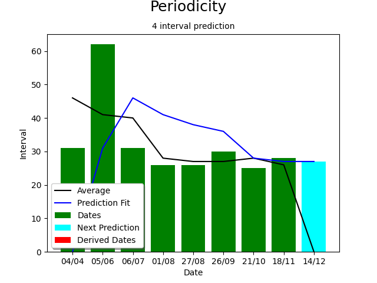
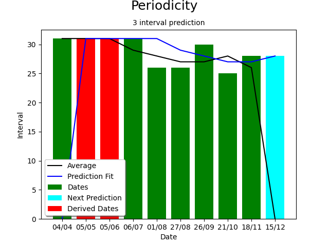

# Periodicity
This program performs interval analysis given a range of dates. It has features to normalise outliers and predict the 
next date in the cycle

## Sample Data

_21/10/2023,26/09/2023,27/08/2023,01/08/2023,06/07/2023,05/06/2023_

Two test data files exist in the 'io' package: test_data.csv and test_data.json

## The Interval Date Set Explained

The Interval date set is calculated from the input dates and is a working set used throughout the program as values are
derived. It has the following format:

_{'from': datetime.date(2023, 3, 4), 'to': datetime.date(2023, 4, 4), 'interval': 31, 'average': 0, 'real': True, '
valid': True}_

| Key      | Value                                                                |
|----------|----------------------------------------------------------------------|
| from     | Start date of interval taken from date input                         |
| to       | End date of interval taken from the date input                       |
| interval | Days between from and to                                             |
| average  | Three months average  of intervals, taken from date before and after |
| real     | True=value was in supplied date, False=value was derived             |
| valid    | True=use this date, False=data has been superceeded                  |

## Charting

The output is in the form of a graph showing derived data.\
\
You can see from these two examples that in the raw data (top) there is a spike caused by a missing date.
In the adjusted example (bottom) this has been removed and replaced with derived data, normalising the curve.

### Legend

Green = Real values taken from the supplied date\
Red = Derived values calculated to replace outliers\
Black line = Three date average value derived from values taken from date before and after\
Blue line = Predictions\
Cyan = Next predicted date

## Predictions

The method used for predictions is based on projecting a multiple dates rolling average forward. This is a hyperthetical
approach and needs to be tested by observation of real data. By default the prediction uses 4 data points to perform its 
predictions

# Development

## Features

1. ~~Extract dates from Google Calendar~~
2. ~~Load dates from CSV~~
3. ~~Load dates for json~~
3. ~~Sort dates~~
4. ~~Calculate elapsed days~~
5. ~~Create CLI~~
5. ~~Identify missing dates, use outliers. Estimate missing date as mid point~~
6. ~~Calculate rolling three interval average~~
7. ~~Plot to chart~~
8. ~~Design prediction data set~~
6. ~~Predict next date~~
7. ~~Plot prediction to graph~~
9. ~~Add Legend to chart~~
8. ~~Make prediction period range dynamic~~
7. ~~Code refactoring~~